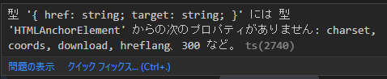

# TypeScriptで型安全にtsxを利用するサンプル(Reactなどのフレームワークなし)

Reactを使えば簡単かつ型安全なtsxでDOMを生成することができます。
しかし、Reactなどフレームワークを利用せずに、TypeScriptのtsxを利用して型安全にDOMを生成する手順が見つからなかったため、手順をまとめました。

https://github.com/murasuke/simpleTsx

一言にまとめると、
* tsxをコンパイルして、h()関数の呼び出しに変換してDOMを生成する。
* tsxを型安全にするため`interface IntrinsicElements`を利用する

## 利用ライブラリ

* [hyperscript](https://www.npmjs.com/package/hyperscript)
  * h('h1', 'hello!') と書くと、`<h1>hello</h1>`と出力してくれるDOM生成ライブラリ
  * tsx(jsx)はDOMの生成機能を持たない(DOM生成用関数の呼び出しに変換する)ため、DOM生成を行うライブラリを使用する
* [jQuery](https://www.npmjs.com/package/jquery)
  * 必須ではないですが、あれば便利なため
* [webpack](https://www.npmjs.com/package/webpack)
  * hyperscript, jQueryをバンドル(ブラウザで上記ライブラリを利用するために必要)
## 動作イメージ

webpackでバンドルした.jsファイルを読み込むだけのhtmlファイルを用意します。

index.html
```html
<!DOCTYPE html>
<html lang="ja">
<body>
    <div id="app"></div>
    <script src="js/bundle.js"></script>
</body>
</html>
```
* tsxファイルで作成した&lt;a&gt;タグをhtmlへ追加します。


index.tsx
```tsx
$(() => {
  $('#app').append(
    <a href="https://npm.im/hyperscript" target="_blank">
    open hyperscript page
    </a>
  );
});
```

* 生成後の画面イメージ

  tsxファイルで記載した&lt;a&gt;タグが追加されます。


## 手順①ライブラリのインストール

* 利用ライブラリ

  package.jsonの初期化と利用ライブラリを追加

```bash
npm init -y
npm i jquery hyperscript
```

* ビルド用ライブラリ

  TypeScript、型定義、webpack、実行確認用Webサーバ(http-server)を追加

```bash
npm i -D typescript
npm i -D @types/hyperscript @types/jquery
npm i -D webpack webpack-cli ts-loader
npm i -D http-server
```

## 手順②コンパイル設定

### typescriptコンパイル設定
ルートフォルダ直下に`tsconfig.json`ファイルを作成し、下記内容を記載します。

tsconfig.json
```json
{
  "compilerOptions": {
    "target": "ES5",
    "module": "CommonJS",
    "strict": true,
    "esModuleInterop": true,
    "forceConsistentCasingInFileNames": true,
    "jsx": "react",
    "jsxFactory": "h"
  },
  "exclude": [
    "node_modules",
    "public"]
}
```
`"jsx": "react"`でjsxを有効にします。
`"jsxFactory": "h"`を指定することで、jsxのコンパイル結果を`h()`という関数に置き換えます。

### webpack設定

ルートフォルダ直下に`webpack.config.js`ファイルを作成し、下記内容を記載します。

```javascript
const path = require('path');

const config = {
  devtool: 'inline-source-map',
  // webpackがバンドルの構築を開始するエントリポイント
  entry: path.resolve(__dirname, 'scripts/index.tsx'),
  output: {
    // 出力するファイル名
    filename: 'bundle.js',
    // 出力フォルダ
    path: path.resolve(__dirname, 'public/js'),
  },
  module: {
    rules: [
      // TypeScriptを処理するローダー
      { test: /\.tsx?$/, loader: 'ts-loader' },
    ],
  },
  resolve: {
    extensions: ['.ts', '.tsx', '.js', '.jsx'],
    // モジュールを探すフォルダ（node_modulesとscriptsフォルダを対象にする）
    modules: ['node_modules', path.resolve(__dirname, 'scripts')],
  },
};

module.exports = config;
```

### package.json scripts設定

scriptsに、ビルド(build)と実行(start)を追加します。

```json
  "scripts": {
    "build": "webpack --mode development",
    "start": "npx http-server ./public -o"
  }
```


## 手順③html作成

`public/index.html`ファイルを作成し下記内容を貼り付けます。

* `js/bundle.js`は、webpackがバンドルするファイル名です。

```html
<!DOCTYPE html>
<html lang="ja">
<body>
    <div id="app"></div>
    <script src="js/bundle.js"></script>
</body>
</html>
```


## 手順④tsxファイル作成

### ④-1最低限の動作サンプル(tsx型定義に制限あり)
tsxで作成した`<a>`タグを、jQueryで`index.html`に追加します。

./scripts/index.tsx

```typescript
import $ from 'jquery';

$(() => {
  $('#app').append(
    <a href="https://npm.im/hyperscript" target="_blank">
      open hyperscript page
    </a>,
  );
});
```

コンパイルしようとすると、このようなエラーが出てしまいます。


これは、`<a>`タグの型情報(タグが持っている属性情報)がないためです。

こんな感じで、IntrinsicElements{}の中に、`a`タグの属性定義を追加します。


./scripts/index.tsx

```typescript
import $ from 'jquery';

declare global {
  namespace JSX {
    interface IntrinsicElements {
      a: { href: string; target: string };
    }
  }
}

// 以下省略
// $(() => {
```

すると`<a>`タグエラーは消えますが`【名前 'h' が見つかりません】` という別のエラーになります。


これは、tsxの`タグ`が`h()`という関数呼び出しに変換されているためです。

`h()`という関数名は、tsconfig.jsonのオプション`"jsxFactory": "h"`で指定した名前です。

---
`npx tsc`でトランスパイルした結果をみると、`h()`関数の呼び出しに変換されています。

```javascript
(0, jquery_1.default)(function () {
    (0, jquery_1.default)('#app').append((0, hyperscript_1.default)("a", { href: "https://npm.im/hyperscript", target: "_blank" }, "open hyperscript page"));
});
```
---

`h()`関数を利用できるようにするため、[hyperscript](https://www.npmjs.com/package/hyperscript)のimportを追加します。

./scripts/index.tsx

```typescript
import $ from 'jquery';
import h from 'hyperscript';

// jsxの型定義
declare global {
  namespace JSX {
    interface IntrinsicElements {
      a: { href: string; target: string };
    }
  }
}

$(() => {
  $('#app').append(
    <a href="https://npm.im/hyperscript" target="_blank">
      open hyperscript page
    </a>,
  );
});
```

`<a>`タグの限られた属性した利用できない問題はありますが、一旦ブラウザで実行できる形になったためビルドと実行を行います

```bash
npm run build
npm run start
```

ブラウザが立ち上がり、tsxで記載した`<a>`タグによるリンクが表示されます


### ④-2最低限の動作サンプル(tsx型定義を修正し、&lt;a&gt;タグの全属性を利用可能にする)

現在の型定義では`<a>`タグかつ、限られた属性(href,target)しか指定できません。
`HTMLAnchorElement`(TypeScriptの組み込み型,lib.dom.d.ts)を利用すると、`<a>`タグのすべての属性をサポートすることができます。

./scripts/index.tsx 型定義変更

```typescript
  interface IntrinsicElements {
    a: HTMLAnchorElement    // 型を変更
  }
```

変更すると、様々なプロパティーが存在しないという別のエラーが発生します。
これを回避するためには`HTMLAnchorElement`の各プロパティーを`省略可`に変更する必要があります。




プロパティーを省略可能に変更する、組み込み関数`Partial<T>`でラップします。

./scripts/index.tsx

```typescript
  interface IntrinsicElements {
    a: Partial<HTMLAnchorElement>;
  }
```
しかし、`Partial<T>`ではstyle属性のように、入れ子になっている場合に対応ができません。
再帰的に適用する関数を別途定義して、そちらを利用するように変更します。

```typescript
type NestedPartial<T> = {
  [K in keyof T]?: T[K] extends Array<infer R>
    ? Array<NestedPartial<R>>
    : NestedPartial<T[K]>;
};

// jsxの型定義
declare global {
  namespace JSX {
    interface IntrinsicElements {
      a: NestedPartial<HTMLAnchorElement>;
    }
  }
}
```

これで`<a>`タグの任意の属性を利用、型チェックできるようになりました。


### ④-3最低限の動作サンプル(tsx型定義を修正し、全タグの全属性を利用可能にする)

`<a>`タグ以外を利用するには、下記のように全てのタグを並べれば良いですがスマートではありません。

```typescript
declare global {
  namespace JSX {
    interface IntrinsicElements {
      "a": HTMLAnchorElement;
      "abbr": HTMLElement;
      "address": HTMLElement;
      // ～～ 以下省略 ～～
    }
  }
}
```

TypeScriptの組み込み型定義に、タグと型定義が揃った`HTMLElementTagNameMap`があるのでこれを利用します。

```typescript
interface HTMLElementTagNameMap {
  "a": HTMLAnchorElement;
  "abbr": HTMLElement;
  "address": HTMLElement;
```

IntrinsicElementsを以下のように書き換えます。
* interfaceをextendで拡張します
* 拡張する際、各属性を再帰的に省略可能にします(`NestedPartial<T>`)

```typescript
declare global {
  namespace JSX {
    interface IntrinsicElements extends NestedPartial<HTMLElementTagNameMap> {}
  }
}
```

これで、tsxを利用して任意のタグを生成することができるようになります。

・・・と言いたいところですが、まだ1点問題が残っています。

* `style={{ backgroundColor: '#ccf' }}`と書いても、背景色が変わらない
  * 原因⇒hyperscriptのStyle属性は`kebab-case`のみサポート。camelCaseは正しく認識されません。

```typescript
$(() => {
  $('#app').append(
    <div style={{ backgroundColor: '#ccf' }}>
      <h2>tsx sample</h2>
    </div>,
  );
});
```

上記の問題を解決するため、hyperscriptの`h()`関数をラップしてstyle内の`camelCase`を`kebab-case`に変換します。


```typescript
import hs from 'hyperscript';

const camelToKebab = (p: string) => {
  return p.replace(/([A-Z])/g, (s) => {
    return '-' + s.charAt(0).toLowerCase();
  });
};

const h = (tagName: string, attrs?: Object, ...children: any[]): Element => {
  if ('object' === typeof attrs) {
    const l = attrs as any;
    for (let k in l) {
      if (k === 'style' && 'string' !== typeof l[k]) {
        for (let s in l[k]) {
          if (s !== camelToKebab(s)) {
            // styleの指定をKebabCaseに変換
            l[k][camelToKebab(s)] = l[k][s];
            // CamelCaseの属性を削除
            delete l[k][s];
          }
        }
      }
    }
  }
  return hs(tagName, attrs, ...children);
};
```

### ④-4最低限の動作サンプル(完成)

1つのファイルに共通で使う部品と、画面に表示するロジックを混在させているため再利用しづらいです。後で分割します。

```typescript
import $ from 'jquery';
import hs from 'hyperscript';

const camelToKebab = (p: string) => {
  return p.replace(/([A-Z])/g, (s) => {
    return '-' + s.charAt(0).toLowerCase();
  });
};

// camelCaseで指定したstyleも適用されるようにするhyperscriptラッパー関数
const h = (tagName: string, attrs?: Object, ...children: any[]): Element => {
  if ('object' === typeof attrs) {
    const l = attrs as any;
    for (let k in l) {
      if (k === 'style' && 'string' !== typeof l[k]) {
        for (let s in l[k]) {
          if (s !== camelToKebab(s)) {
            // styleの指定をkebab-caseに変換
            l[k][camelToKebab(s)] = l[k][s];
            // camelCaseの属性を削除
            delete l[k][s];
          }
        }
      }
    }
  }
  return hs(tagName, attrs, ...children);
};

// 属性を再帰的に省略可能にするユーティリティー
type NestedPartial<T> = {
  [K in keyof T]?: T[K] extends Array<infer R>
    ? Array<NestedPartial<R>>
    : NestedPartial<T[K]>;
};

// jsxの型定義
declare global {
  namespace JSX {
    interface IntrinsicElements extends NestedPartial<HTMLElementTagNameMap> {}
  }
}

// html側にDOMを追加
$(() => {
  $('#app').append(
    <div style={{ backgroundColor: '#ccf' }}>
      <h2>tsx sample</h2>
      <div id="div1" className="classname1">
        <input type="text" id="text1" value="text1" />
        <button onclick={() => alert($('#text1').val())}>
          show textbox value
        </button>
      </div>
      <a href="https://npm.im/hyperscript" target="_blank">
        open hyperscript page
      </a>
    </div>,
  );
});
```

* 画面イメージ

  style、イベント(onclick)なども想定通りに動作します。


### ④-5最低限の動作サンプル(おまけ、共通関数を./lib/libtsx.tsに抜き出す)

共通関数を./lib/libtsx.tsに抜き出し、tsxを利用する側でimportして使えるようにします。

./scripts/lib/tsxlib.ts

```typescript
import hs from 'hyperscript';

/**
 * キャメルケースからケバブケースに変換する
 * @param p
 * @returns
 */
const camelToKebab = (p: string) => {
  return p.replace(/([A-Z])/g, (s) => {
    return '-' + s.charAt(0).toLowerCase();
  });
};

/**
 * hyperscriptラップ関数
 * ・hyperscriptではKebabCaseのみ有効。CamelCaseでもStyleが有効になるように変換する
 * h('div', { style: { 'background-color': '#f22' } }, 'style')・・・OK
 * h('div', { style: { backgroundColor: '#f22' } }, 'style')・・・NG(styleが適用されない)
 * @param tagName
 * @param attrs
 * @param children
 * @returns
 * @example <div style={{ backgroundColor: '#f33' }}>
 *   ⇒ <div style={{ background-color: '#f33' }}>に変換してhyperscriptへ渡す
 */
const h = (tagName: string, attrs?: Object, ...children: any[]): Element => {
  if ('object' === typeof attrs) {
    const l = attrs as any;
    for (let k in l) {
      if (k === 'style' && 'string' !== typeof l[k]) {
        for (let s in l[k]) {
          if (s !== camelToKebab(s)) {
            // styleの指定をkebab-caseに変換
            l[k][camelToKebab(s)] = l[k][s];
            // camelCaseの属性を削除
            delete l[k][s];
          }
        }
      }
    }
  }
  return hs(tagName, attrs, ...children);
};

/**
 * HTMLElementTagNameMapの属性をすべてpartial(任意)に変更する(孫を含め再帰的に適用する)
 * ⇒<div></div>と記載した際にコンパイルエラーとしないようにするため
 */
type NestedPartial<T> = {
  [K in keyof T]?: T[K] extends Array<infer R>
    ? Array<NestedPartial<R>>
    : NestedPartial<T[K]>;
};

/**
 * TSXの型指定
 * ・HTMLElementTagNameMap型に含まれる「タグ」名のみを有効とする
 * 　<div> ・・・ コンパイル可能
 *   <test> ・・・コンパイルエラー
 */
declare global {
  namespace JSX {
    interface IntrinsicElements extends NestedPartial<HTMLElementTagNameMap> {}
    // 存在しないタグ名であってもエラーにしないようにする場合は、下記に置き換える
    // interface IntrinsicElements {
    //   [tagName: string]: any;
    // }
  }
}

export default h;
```

tsxlibをimportすることで、修正版`h()`の利用と、tsxの型定義が利用できるようになります。

./scripts/index.tsx

```typescript
import h from './lib/tsxlib';
import $ from 'jquery';

$(() => {
  $('#app').append(
    <div style={{ backgroundColor: '#ccf' }}>
      <h2>tsx sample</h2>
      <div id="div1" className="classname1">
        <input type="text" id="text1" value="text1" />
        <button onclick={() => alert($('#text1').val())}>
          show textbox value
        </button>
      </div>
      <a href="https://npm.im/hyperscript" target="_blank">
        open hyperscript page
      </a>
    </div>,
  );
});
```
